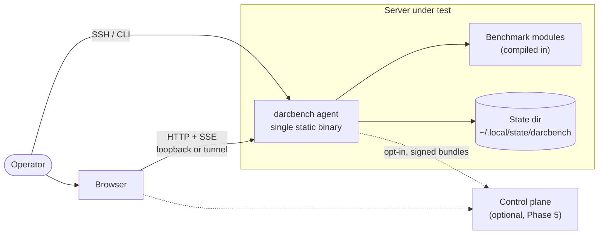
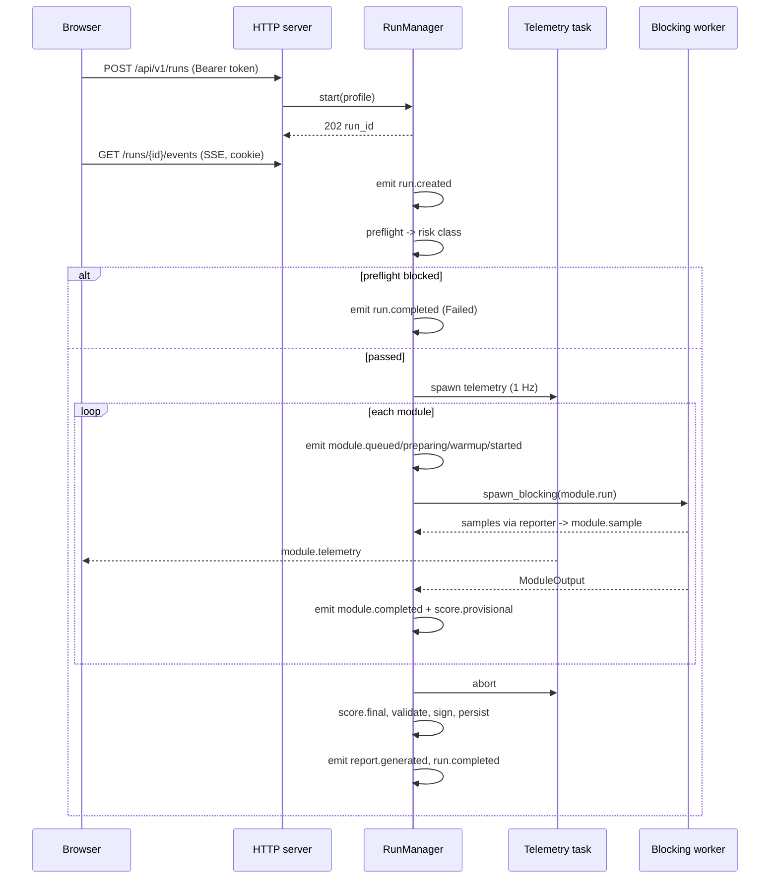
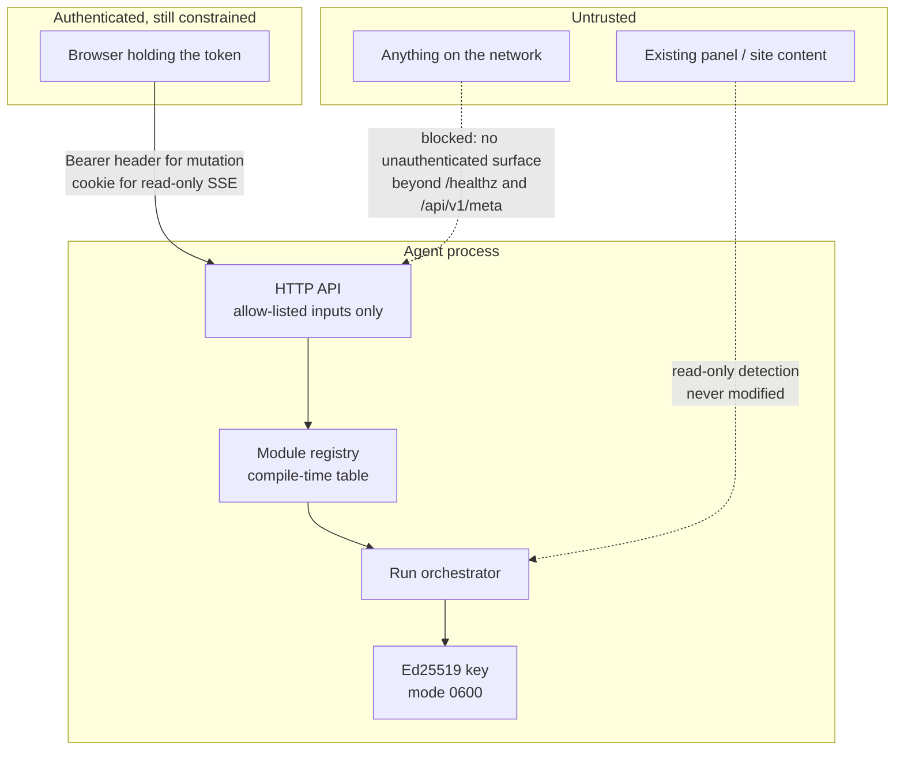
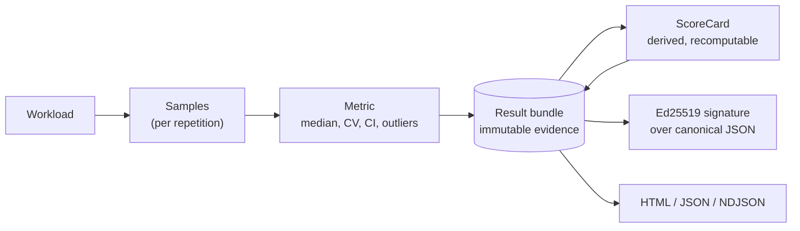

# DARCBench architecture

Authoritative for how the system is built. Decisions are recorded individually
in `docs/adr/`; this document explains how they fit together.

---

## 1. System context

Two operating modes, one binary:

- **Standalone.** `darcbench serve` or `darcbench run`. No account, no network
  egress, no contact with any DARCBench service. Fully useful on its own — this
  is a hard product requirement, not a fallback.
- **Connected.** The same agent optionally uploads signed result bundles to a
  control plane for history, comparison, fleets and leaderboards. Phase 5.

---

## 2. Components

| Component | Language | Responsibility |
|---|---|---|
| `darcbench-protocol` | Rust | Wire types: ids, metrics, statistics, events, run lifecycle, result states |
| `darcbench-inventory` | Rust | Read-only system discovery, environment classification, telemetry sampling, redaction |
| `darcbench-scoring` | Rust | Pure scoring model: normalisation, aggregation, composites |
| `darcbench-core` | Rust | The portable measurement engine: module contract, timing harness, workloads, `cpu.mixed`, `memory.bandwidth`. No OS dependency; shared by both product lines (ADR-0015) |
| `darcbench-modules` | Rust | The server line's workloads - web, database, CMS, storage, network, deployment - and the allow-list registry |
| `darcbench-report` | Rust | Result bundles, canonical JSON, Ed25519 signing, validation, HTML rendering |
| `darcbench-agent` | Rust | CLI, dashboard server, run orchestration, preflight safety |
| `apps/web` | TypeScript / React | The dashboard, compiled into the agent binary |
| `apps/control-plane` | — | Phase 5. Not started; see ADR-0010 |

Dependency direction is strictly downward. `protocol` depends on nothing in the
workspace; `scoring` depends only on `protocol`; the agent depends on all of
them. Nothing depends on the agent. That is what makes the scoring model
reusable by a server that never runs a benchmark.

---

## 3. Why Rust, and why one binary

Recorded fully in ADR-0001. The short version:

- **No GC.** A collector pause during a timed repetition is measurement error
  attributed to the machine under test. Go was the main alternative and was
  rejected primarily for this.
- **Single static binary.** `scp` it to a server and run it. No runtime, no
  package manager, no dependency on the Python or PHP the customer's site needs.
- **`unsafe_code = "forbid"`** across the workspace. A benchmark tool runs as a
  privileged-adjacent process on production machines; memory-safety bugs are
  not an acceptable class of risk here.
- **The workloads themselves are Rust**, so they compile to the same code on
  every target and there is no interpreter version to confound results.

The web UI is compiled into the binary by `crates/darcbench-agent/build.rs`. If
`apps/web/dist` is absent, the build emits an empty asset table and the agent
serves a small built-in console instead — so a Rust-only checkout, a minimal
container image and a distribution package all still produce a *working* agent.

---

## 4. Run lifecycle

Three properties worth calling out:

**Benchmarks never run on the async runtime.** Every module executes inside
`tokio::task::spawn_blocking`. A CPU-saturating workload on a worker thread
would starve the HTTP server and the telemetry sampler, and the UI would appear
frozen exactly when it matters most.

**One run at a time.** `RunManager::start` returns `AlreadyRunning` if a run is
in flight. Two benchmarks sharing a machine measure each other.

**Cancellation always produces a bundle.** A cancelled run is written out and
marked `Invalid` with an `Interrupted` reason. "The operator stopped it" is
itself a fact worth recording, and half-written state is worse than a
clearly-labelled incomplete result.

---

## 5. Trust boundaries

The critical boundary is `API → Registry`. A caller submits a *module id
string*; the registry either maps it to a compiled-in implementation or rejects
it. **There is no code path from an HTTP request to a shell, a filesystem path
or a command line.** That is what makes it acceptable to put a "start benchmark"
button in a browser at all. Full analysis in `docs/THREAT-MODEL.md`.

---

## 6. Real-time transport

Server-Sent Events, not WebSocket. ADR-0004 has the full reasoning; the summary:

- The traffic is overwhelmingly **one-directional** (agent → browser). Control
  is a handful of ordinary HTTP requests.
- SSE survives reverse proxies and corporate middleboxes that break WebSocket
  upgrades — and DARCBench is specifically designed to be reachable through
  whatever proxy a hosting server already runs.
- **Reconnection and replay are built in.** The browser retries automatically
  with `Last-Event-ID`; the agent replays from its buffer.
- A lagging consumer ends the stream rather than being silently truncated,
  forcing a reconnect that can actually recover the gap.

Ordering, idempotency and backpressure are specified in
`docs/REALTIME-PROTOCOL.md`.

---

## 7. Data flow and the evidence/score split

Raw measurements are immutable evidence; scores are a pure function of them.
That separation is what lets a new scoring model rescore every historical run
without re-running a single benchmark — and it is also the anti-tamper
mechanism: editing a score without editing the metrics is caught by
recomputation, and editing the metrics breaks the signature.

Verified live: editing `scores.total` in a stored bundle yields
`signature INVALID` **and** `score recompute MISMATCH`.

---

## 8. Storage

| Data | Standalone | Control plane (Phase 5) |
|---|---|---|
| Run artifacts | `<state>/runs/<run_id>/{bundle.json,report.html,events.ndjson}` | Object storage |
| Agent key | `<state>/agent.key`, mode `0600` | n/a |
| Run index | `<state>/index.db` (SQLite), rebuilt from the bundles at startup | PostgreSQL |

ADR-0005 selects SQLite for standalone metadata and PostgreSQL + object storage
for the control plane. Phase 1 uses a plain filesystem layout because a run
index over a handful of directories does not need a database yet; the migration
is bounded because `RunManager` is the only thing that touches persistence.

---

## 9. Extensibility

The module contract (`docs/BENCHMARK-MODULE-SPEC.md`) is versioned. A module
declares, before it runs: its safety class, maximum bytes written, maximum
network bytes, dependencies, cleanup behaviour, validation conditions,
comparability fields and known limitations. Preflight consumes those
declarations to compute the risk class and to refuse unsafe runs.

Third-party modules **cannot** contribute to the official total score. This is
deliberate and conservative: a total score whose inputs anyone can extend is not
a score anyone can trust. They can be run, they can produce their own scores,
and they are labelled `Custom`. Revisiting this requires a signed-module
registry and is out of scope until Phase 8 (ADR-0006).

---

## 10. What is deliberately not here

- **No plugin system in Phase 1.** The registry is a compile-time table. Dynamic
  loading is a security decision, not a convenience one.
- **No cloud metadata queries.** DARCBench never reads `169.254.169.254`. Those
  responses carry credentials, and an SSRF-shaped read is not something a
  benchmark should perform. Cloud platform is inferred from DMI strings only.
- **No configuration management.** The agent never edits nginx, Apache, Plesk,
  cPanel, firewall or systemd configuration. `docs/INSTALLER-AND-DISCOVERY.md`
  specifies the exposure hierarchy that makes this possible.
- **No telemetry to us.** Standalone mode sends nothing anywhere: no telemetry,
  no update check, no analytics, no crash reporting. Since `network.transfer`
  shipped that is a statement about *what* is sent, not about whether a socket
  is ever opened — measuring a network requires contacting one. The traffic that
  module generates goes to a compile-time allow-list of measurement endpoints
  (`crates/darcbench-modules/src/network_endpoints.rs`), carries no inventory,
  result or identifier, is bounded by a ceiling the module enforces, and is
  disclosed in preflight before the run starts. The `quick` profile excludes it,
  so the first run anyone makes on an unfamiliar server still opens no socket.
