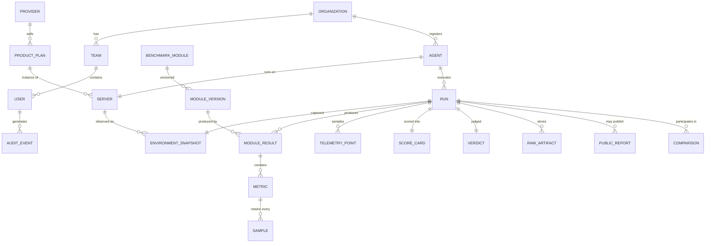

# Data model

The governing principle: **immutable evidence is separated from derived scores.**
Raw measurements are facts about what a machine did. Scores are an opinion about
what those facts mean, expressed by a versioned model. Keeping them apart is what
makes rescoring, verification and tamper detection all possible with the same
mechanism.

## Entities



Entities above the line exist in Phase 1 as concrete Rust types; organisations,
teams, providers, plans, public reports, comparisons and audit events are the
control-plane schema (Phase 5), specified here so nothing built earlier blocks
them.

## The evidence layer (immutable)

| Type | Rust | Key fields |
|---|---|---|
| `Sample` | `MetricSample` | `rep`, `value`, `duration_ms`, `warmup` |
| `Metric` | `Metric` | `key`, `label`, `unit`, `direction`, `value` (median), `summary`, `samples[]`, `outliers[]` |
| `Summary` | `stats::Summary` | `n`, `min`, `max`, `mean`, `median`, `stddev`, `cv`, `ci95` |
| `ModuleResult` | `ModuleResult` | `module` (id + version), `status`, timestamps, `metrics[]`, `warnings[]`, `context` |
| `EnvironmentSnapshot` | `Inventory` | platform, cpu, memory, storage, network, software, `gaps[]` |
| `TelemetryPoint` | `TelemetrySnapshot` | CPU busy/steal/iowait, load, memory, swap, frequency, temperature, PSI, I/O rates |

Every repetition is retained, in physical units, warm-ups included and flagged.
Outliers are recorded as indices, never removed.

`gaps[]` is important: a fact the collector could not determine is *reported*,
not defaulted. A silently-zero core count would corrupt every score derived
from it.

## The derived layer (recomputable)

| Type | Rust | Notes |
|---|---|---|
| `ScoreCard` | `ScoreCard` | Total, categories, facets, composites, stability, efficiency, `uncalibrated`, `uncapped_total`, `weak_link_applied`, `balance_index`, `missing_required_categories`, `unreferenced_metrics` |
| `Verdict` | `Verdict` | `state`, typed `reasons[]`, `validator_version` |

`ScoringModel::score_run(profile, &[ModuleResult]) -> ScoreCard` is a pure
function. Given the evidence layer and a model version, the derived layer is
reproducible byte for byte — which is what server-side recomputation checks.

`unreferenced_metrics` deserves a note: a metric with no reference anchor is
*surfaced*, not dropped, so a module that silently stopped contributing to a
score is visible rather than invisible.

## The bundle

`darcbench.bundle/1`:

```
Bundle
├── meta       schema, protocol, agent_version, build_target, build_profile, generated_at
├── run        run_id, profile, state, timestamps, duration, modules[],
│              environment_digest, events_digest, event_count
├── environment  full Inventory, serialised under the ambient redaction policy
├── modules[]  ModuleResult — the evidence
├── scores     ScoreCard — derived
├── verdict    Verdict
├── telemetry  TelemetrySummary (aggregated; the full series stays on disk)
└── signature  Ed25519 over canonical JSON of everything above
```

Two digests, doing different jobs. `environment_digest` covers only
performance-relevant facts — CPU model, topology, memory size, kernel,
virtualization, cgroup limits — so it detects a machine changing materially
mid-run while excluding volatile values like free memory and identifying values
like hostname. It is therefore safe to publish. `events_digest` covers the
ordered event stream, so a viewer can prove the events they saw match the bundle
they were given.

Telemetry is summarised in the bundle rather than shipped raw: a 60-minute
endurance run at 1 Hz is 3600 samples per field, which does not belong in a
shareable artifact. The full series stays in the run directory.

## On-disk layout

```
$DARCBENCH_HOME/                 # or $XDG_STATE_HOME/darcbench, ~/.local/state/darcbench
├── agent.key                    # Ed25519 seed, mode 0600
├── index.db                     # SQLite run index. Derived; delete it and the
│                                # agent rebuilds it from the bundles at startup
└── runs/<run_id>/
    ├── bundle.json
    ├── report.html
    └── events.ndjson
```

Every write goes through `StatePath::join`, which rejects `.`, `..`, separators
and NUL, and asserts the result is under the root.

## Result states

| State | Meaning | Rankable |
|---|---|---|
| `Local` | Never left the machine | ❌ |
| `SelfReported` | Validly signed, nothing else checked | ❌ |
| `Validated` | Server recomputed every score; invariants held | ✅ |
| `Verified` | Validated + server nonce + known agent build hash | ✅ |
| `Official` | Verified + DARCBench-controlled provisioning | ✅ |
| `Partial` | Required modules missing or degraded | ❌ |
| `Custom` | Non-standard module set or profile | ❌ |
| `Invalid` | Failed validation — **retained**, never deleted | ❌ |

Invalid results are kept. Deleting them would hide evidence, and the reason a run
failed is often more informative than the run succeeding would have been.

## Retention

- Bundles and event streams are immutable once written.
- Rescoring under a new model **adds** a score card; it never overwrites one.
- Deleting a public report unpublishes it; the underlying evidence is retained
  for audit under the policy in [PRIVACY.md](PRIVACY.md).

Standalone pruning is an **explicit command**, never a background sweep:

```
darcbench prune --older-than-days 90            # reports what it would remove
darcbench prune --keep-last 50 --confirm        # applies it
```

Three rules, each of which exists because deleting a benchmark result cannot be
undone and the bundle is the only copy:

- **No policy selects nothing.** `darcbench prune` with neither flag exits
  non-zero rather than treating "no policy" as "everything".
- **Nothing is deleted without `--confirm`.** The default is a report.
- **`Invalid` runs are never removed**, whatever the policy selects. They are
  listed as retained so the operator can see the policy did not silently apply
  in full.

The run index is updated to match; it is derived from the bundles either way, so
deleting `index.db` by hand costs a rebuild at the next startup and nothing
else.
