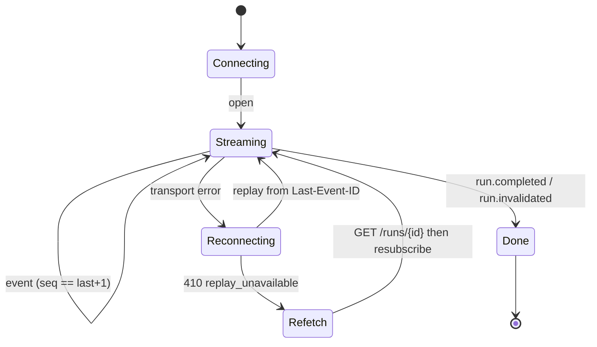

# Real-time event protocol

**Version:** `darcbench.events/1`
**Implementation:** `crates/darcbench-protocol/src/events.rs`
**Transport decision:** [ADR-0004](adr/0004-realtime-transport.md)

## 1. Envelope

Every event, on every transport, carries the same frame:

```json
{
  "protocol": "darcbench.events/1",
  "run_id": "run_fbf97974a668f08632f236e434a30f8d",
  "seq": 42,
  "ts": "2026-08-03T06:08:29.260720831Z",
  "mono_ms": 12616,
  "type": "module.sample",
  "...": "payload fields, flattened"
}
```

| Field | Meaning |
|---|---|
| `protocol` | Major version. Reject an unknown major; ignore unknown fields within a known one |
| `run_id` | `run_` + 32 lowercase hex characters |
| `seq` | **Gapless**, 0-based, monotonically increasing by exactly 1 |
| `ts` | Wall clock, RFC 3339 UTC. For humans and correlation only |
| `mono_ms` | Milliseconds on the **monotonic** clock since run start |
| `type` | Internally tagged discriminator |

**Two clocks, deliberately.** Wall clock can jump — NTP steps, VM migration,
suspend. Any duration reasoning must use `mono_ms`. A run whose wall clock moves
backwards is flagged `ClockAnomaly` and invalidated.

## 2. Event families

| Kind | When | Notable payload |
|---|---|---|
| `run.created` | Once, first | `profile`, `modules`, `agent_version`, `scoring_model`, `environment_digest` |
| `run.preflight.started` | Before checks | `checks[]` |
| `run.preflight.completed` | After checks | `risk`, `passed`, `findings[]`, `estimated_duration_s`, `estimated_bytes_written`, `estimated_network_bytes`, `estimated_peak_memory_bytes`, `estimated_write_volume_bytes` |
| `module.queued` / `preparing` / `warmup` / `started` | Per module phase | `module`, `index`, `total`, `phase` |
| `module.sample` | Per repetition | `metric_key`, `rep`, `warmup`, `value`, `unit`, `duration_ms`, `module_progress` |
| `module.telemetry` | 1 Hz while running | CPU busy/steal/iowait, load, memory, swap, frequency, temperature, PSI, disk and network rates |
| `module.warning` | Typed observation | `code`, `message`, `metric_key` |
| `module.completed` | Module finished | Full `ModuleResult` including every sample |
| `module.failed` | Module errored | `error`, `fatal` |
| `module.cancelled` | Operator cancelled | `module`, `index`, `total` |
| `score.provisional` | After each module | `total`, `categories[]`, `uncalibrated` |
| `score.final` | Before completion | Same shape, `provisional: false` |
| `report.generated` | Artifacts written | `formats[]`, `bundle_sha256`, `bytes` |
| `run.completed` | Terminal | `state`, `verdict`, `modules_completed`, `modules_failed`, `final_seq` |
| `run.invalidated` | Terminal | `verdict` |
| `stream.heartbeat` | Every 10 s | `state`, `last_seq` — no run semantics |

`run.completed` and `run.invalidated` are the only stream-terminal events.

## 3. Ordering, replay and idempotency

**Ordering.** `seq` is assigned under a single atomic counter in emission order.
A consumer must process in `seq` order and must never interpolate across a gap.

**Replay.** SSE `id:` carries `seq`. A reconnecting client sends `Last-Event-ID`
(or `?last_event_id=`); the agent replays everything after it, then joins the
live stream.

The agent MUST subscribe to the live channel **before** snapshotting the
backlog, and filter duplicates by `seq`. The reverse order leaves a window in
which an event is in neither the snapshot nor the subscription - and near the
end of a run the event lost that way is typically `report.generated` or
`run.completed`, so a reconnecting dashboard would wait at "running" forever.
Overlap between the two is harmless because the stream is idempotent per `seq`.

**Buffer exhaustion.** The replay buffer holds 4096 events. If the requested
position has been evicted, the agent returns **`410 Gone`** with
`code: replay_unavailable` rather than a silently truncated prefix. Asking for a
position past the end is not an error — it simply yields nothing.

**Idempotency.** Folding the same event twice must be a no-op. The reference UI
reducer drops any event with `seq <= lastSeq`.

**Backpressure.** A consumer that falls behind the broadcast channel has its
stream ended, forcing a reconnect with `Last-Event-ID` — the only path that can
actually recover the missed events.

**Heartbeats.** SSE keep-alive comments every 15 s keep proxies from timing out;
`stream.heartbeat` events every 10 s let a client distinguish "nothing is
happening" from "the agent died".

## 4. Client state machine



**Offline completion.** The run continues if every client disconnects. Events
accumulate in the buffer and are persisted to `events.ndjson`, so a client that
reconnects after the run finished still reconstructs the full history.

## 5. Integrity

Every run records an `events_digest`: SHA-256 over the newline-separated
canonical JSON of the ordered event stream. A consumer that captured the stream
can prove the events it was shown match the bundle it was given.

## 6. Compatibility

- **Additive changes** (new fields, new event kinds) do not bump the major
  version. Consumers must ignore unknown fields and unknown kinds.
- **Breaking changes** bump to `darcbench.events/2`. The agent will serve both
  for at least one minor release.
- A consumer that rejects unknown event kinds is non-conforming. A test
  (`unknown_fields_within_a_known_version_are_tolerated`) covers the agent side.

## 7. Transport bindings

| Transport | Status | Notes |
|---|---|---|
| SSE (`GET /api/v1/runs/{id}/events`) | ✅ | Cookie or bearer auth; read-only |
| NDJSON file (`events.ndjson`) | ✅ | One envelope per line, written at finalisation |
| WebSocket | Not planned | See ADR-0004 |
| Agent to control plane | Phase 5 | Batched NDJSON upload, resumable |
