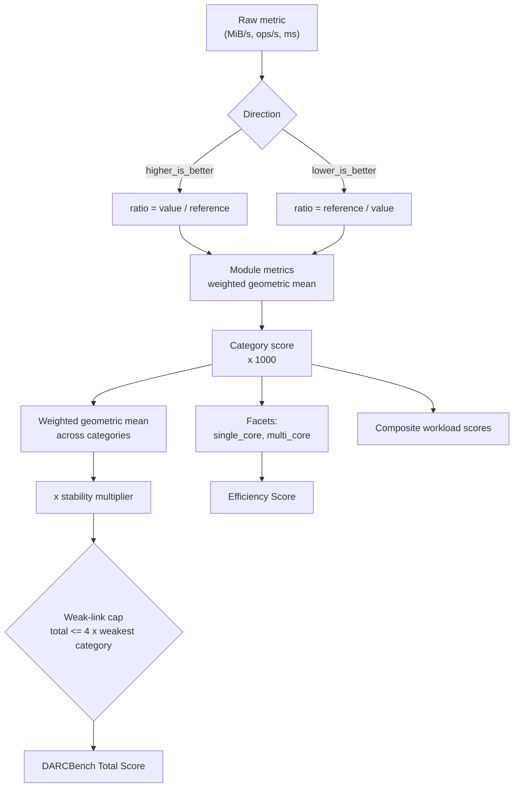

# DARCBench scoring system

**Model version implemented today:** `dbs/0.2.0-dev`

`dbs/0.1.0-dev` remains recomputable: a bundle is verified against the model it
declares, so nothing signed under the earlier model became unverifiable when the
model moved. The difference between them is that `dbs/0.2.0-dev` no longer
scores the `network.transfer` latency metrics — they are measured and published,
but a machine whose link renegotiated from 1000 to 100 Mbit/s moved every
throughput metric by four to five times and moved none of them, so they describe
where a machine is rather than what it is. See
[FIELD-EVIDENCE.md](FIELD-EVIDENCE.md).
**Reference profile:** `DARC-REF-1` — **uncalibrated**
**Authoritative implementation:** `crates/darcbench-scoring/`

Everything in this document is implemented, tested and recomputable. If this
document and `model.rs` ever disagree, `model.rs` wins and this document is a
bug.

---

## 0. The one thing to read first

`dbs/0.2.0-dev` is **not calibrated**. Its reference values are *declared
targets* for a specified machine, not measurements taken from one. Every score
this build produces carries `uncalibrated: true`, every report renders a banner
saying so, and a unit test (`shipped_model_is_marked_uncalibrated`) fails the
build if that flag is ever quietly cleared.

Raw measurements are real. Scores derived from them are development output.
They are not comparable with any future calibrated release, and the `-dev`
suffix in the model version is there so a bundle produced today can never be
mistaken for one produced by a calibrated build.

---

## 1. Design constraints

The scoring model has to satisfy seven constraints simultaneously. Most of the
design falls out of the tension between them.

| # | Constraint | Mechanism |
|---|---|---|
| 1 | Higher is always better | `Direction` inverted exactly once, in `normalise()` |
| 2 | Scores stay meaningful as hardware improves | Fixed reference machine, not a rolling maximum |
| 3 | One strong subsystem cannot hide a catastrophic one | Weighted geometric mean **plus** a weak-link cap |
| 4 | Core count alone must not buy a good score | Separate single-core / multi-core facets; efficiency score |
| 5 | Network speed must not dominate a compute score | Network capped at 8% of the total |
| 6 | Instability must cost something, but not everything | Bounded stability multiplier (max 10% penalty) |
| 7 | Any historical run can be rescored | Scoring is a pure function of raw metrics |

Constraint 7 is why `darcbench-scoring` has no I/O, no clock and no state:
`ScoringModel::score_run` is deterministic, and a test asserts it.

---

## 2. The pipeline



### 2.1 Normalisation

```
higher_is_better:  ratio = value / reference
lower_is_better:   ratio = reference / value
```

Latency is inverted **exactly once**, inside `normalise()`. No other function in
the crate is permitted to inspect `Direction`. That single-point-of-inversion
rule is what prevents the classic double-inversion bug that ranks the slowest
machine first, and it is covered by
`latency_metrics_are_inverted_exactly_once`.

A `lower_is_better` metric measured as zero is rejected, not scored as
infinitely fast: a zero-latency measurement is a broken measurement.

### 2.2 Aggregation

Every level up to the total uses a **weighted geometric mean** of normalised
ratios:

```
score = 1000 × exp( Σ wᵢ·ln(rᵢ) / Σ wᵢ )
```

Computed in log space to avoid overflow. Following SPEC's published rationale
([spec.org/cpu2017/Docs/overview.html](https://www.spec.org/cpu2017/Docs/overview.html)),
the geometric mean weights low results more heavily than an arithmetic mean,
which discourages optimising for a single sub-test.

A non-positive input returns `None` rather than annihilating the aggregate — a
zero sub-score must fail the run, not silently zero the machine.

### 2.3 The weak-link cap

**This is the part a geometric mean alone does not give you, and we found that
out the hard way.**

An early version relied on the geometric mean for constraint 3. A unit test
disproved it. With the standard category weights, a machine at **4× reference**
in compute, memory, network and web but **0.02× reference** in storage
aggregates to roughly **1.13× reference** — a server whose disk is fifty times
slower than normal would be reported as *above average*. That is not
hypothetical: it is exactly what a cloud instance with exhausted burst credits
or a degraded network-attached volume looks like.

So the total is additionally capped:

```
total = min( geometric_total × stability_multiplier,
             weak_link_cap_factor × min(category_scores) )
```

with `weak_link_cap_factor = 4.0`.

**Rationale.** Real server workloads are pipelines. A subsystem several times
slower than the rest of the machine dominates end-to-end time regardless of how
fast the other parts are — Amdahl's argument applied to subsystems rather than
to code. The claim the cap encodes is: *the machine as a whole may be claimed to
be at most four times as good as its worst measured part.*

**Why 4.0.** High enough that an ordinarily uneven machine is untouched — a 2×
spread between best and worst category never triggers it
(`weak_link_cap_leaves_merely_uneven_machines_alone`). Low enough that the
catastrophic case above drops from 1133 to 80.

**The cap is never hidden.** Every score card publishes:

- `uncapped_total` — what the aggregate was before the cap
- `weak_link_applied` — whether the cap actually bound
- `balance_index` — weakest category ÷ geometric mean of all categories, in
  `(0, 1]`; 1.0 is perfectly balanced

and the HTML report renders an explicit banner when the cap engages. A silent
deduction would be worse than no deduction.

### 2.4 Stability

```
stability_index      = clamp(1 − median_CV / cv_ceiling, 0, 1)     # cv_ceiling = 0.20
Stability Score      = 1000 × stability_index
stability_multiplier = 0.90 + 0.10 × stability_index
```

A maximally unstable machine loses **10%** of its total — enough to matter,
bounded so that variance never becomes the dominant term. When no variance
information exists at all, `stability_index` defaults to **0.5**, not 1.0:
absence of evidence of instability is not evidence of stability.

### 2.5 Sustained performance — `endurance` only

The `endurance` profile repeats its module set in **cycles** until a duration
target elapses. Each cycle is a complete, independently comparable measurement,
so the run produces a time series rather than a point.

```
per_metric_retention = median(closing third of cycles) / median(opening third)   # higher-is-better
                     = median(opening third) / median(closing third)             # lower-is-better
retention                  = geometric_mean(per_metric_retention)
Sustained Performance Score = 1000 × min(retention, 1)
```

Category scores for a cycling run come from the **last complete cycle**, not
from an average over the run. Averaging a machine's burst throughput with its
post-throttling throughput produces a number that describes neither, and the one
an operator lives with is the second.

Three properties worth stating explicitly:

**Retention is drift; CV is noise.** They are separate findings and the model
keeps them apart. Variation *within* a cycle is measurement noise and feeds the
stability multiplier. Variation *across* cycles pointing in one direction is the
machine getting slower. Pooling them would report a machine that halved at
minute forty as merely "unstable" — which sends a reader to re-run on a quieter
host instead of telling them what they are buying — and would penalise the same
fact twice.

**The direction adjustment is not cosmetic.** A latency metric gets worse by
getting larger, so its ratio is inverted. Without that, a run whose fsync
latency doubled would be reported as having retained 200% of its performance.

**The score is capped at 1000, the observation is not.** A machine that speeds
up over an hour — page cache warming, a governor settling — is reported as
having lost nothing. The raw `retention` stays in the bundle unclamped so the
cap is auditable, exactly as `uncapped_total` is for the weak-link cap.

Absent, rather than 1.0, for every non-cycling profile. A run that was never
given time to decline has not demonstrated that it would not.

### 2.6 Efficiency

```
Efficiency Score = geometric_mean(single_core_score, multi_core_score)
```

This is what separates a 4-thread high-frequency machine from a 32-thread
machine that is merely wide. A pure multi-core number rewards buying vCPUs; this
rewards buying *useful* vCPUs.

Cost-efficiency (score per currency unit) is deliberately **not** in the model.
It requires a price the agent cannot know, it changes without the machine
changing, and baking a vendor's price list into a benchmark score would
compromise neutrality. It belongs in the control plane, computed from a
user-supplied price, and is listed as such in `docs/COMMERCIAL-STRATEGY.md`.

---

## 3. Reference: DARC-REF-1

Normalisation is against a **specified** machine, not the best machine seen so
far. A moving reference silently rewrites history every time a faster CPU ships;
a fixed reference keeps a 2026 score meaningful in 2030.

| Component | Specification |
|---|---|
| CPU | 8 physical cores / 16 threads, x86-64-v3, ~3.8 GHz sustained all-core |
| Memory | 64 GB DDR5-4800 ECC, dual channel |
| Storage | 2 × NVMe PCIe 4.0 datacenter SSD, software RAID 1, ext4, `relatime` |
| Network | 1 Gbit/s symmetric, unmetered |
| OS | Debian 12, kernel 6.1 LTS, `performance` governor, default mitigations |

**Why this machine.** It is close to the median *modern web hosting dedicated
server actually sold today* — the Hetzner AX52 class (Ryzen 7 7700, 64 GB DDR5,
2 × 1 TB Gen4 NVMe;
[hetzner.com press release](https://www.hetzner.com/pressroom/neue-dedicated-server-2023/),
accessed 2026-08-03). Anchoring on a machine people really buy means a score of
1000 carries an intuitive meaning — "as fast as a normal good web server" —
instead of being an arbitrary index.

**Anchor value: 1000.** Chosen over a larger anchor (Geekbench-style 2500,
PassMark-style five figures) because it makes the ratio legible without a lookup
table: a 2400 machine is 2.4× the reference, full stop. A large anchor implies a
precision this model does not have.

### 3.1 Calibration procedure (Phase 2, blocking a `1.0` scoring release)

1. Provision three physically distinct hosts matching the DARC-REF-1
   specification, from at least two vendors.
2. Set `performance` governor; disable SMT-dependent tuning; record firmware,
   microcode and kernel versions.
3. Run the `deep` profile 10 times per host, with ≥30 minutes idle between runs.
4. For each metric: take the median of per-host medians. Reject any metric whose
   across-host CV exceeds 5% and investigate before proceeding.
5. Write the results into `reference::provisional_reference`, set
   `calibrated: true`, and bump the model to `dbs/1.0.0`.
6. Publish the raw calibration bundles alongside the release. A reference nobody
   can check is not a reference.

Until step 6 is done, the model stays `-dev`.

---

## 4. Published scores

| Score | Availability |
|---|---|
| DARCBench Total Score | Requires compute, memory, storage, network, web |
| Compute Score | ✅ implemented (`cpu.mixed`) |
| Single-Core Score | ✅ implemented (facet) |
| Multi-Core Score | ✅ implemented (facet) |
| Memory Score | ✅ implemented (`memory.bandwidth`) |
| Storage Score | ✅ implemented (`storage.mixed`) |
| Network Score | ✅ implemented (`network.transfer`) |
| Web Score | Phase 3 |
| PHP Score | Phase 3 (sub-score of Web) |
| Node.js Score | Phase 3 (sub-score of Web) |
| Database Score | Phase 4 |
| WordPress Score | Phase 4 (sub-score of Web) |
| Deployment Score | Phase 4 |
| Sustained Performance Score | ✅ implemented (`endurance` profile only) |
| Efficiency Score | ✅ implemented |
| Stability Score | ✅ implemented |

Anchors are only added in the same change that adds the module that produces
them. A test (`anchors_exist_only_for_implemented_modules`) enforces this,
because pre-populating reference values for workloads nobody has ever run would
be fabricated data.

### 4.1 Category weights (standard profile)

| Category | Weight | Why |
|---|---:|---|
| Compute | 0.26 | Drives PHP latency, template rendering, TLS |
| Storage | 0.20 | The most common real bottleneck in web hosting |
| Web | 0.18 | End-to-end request serving |
| Memory | 0.12 | Bandwidth and latency matter, capacity is a spec sheet fact |
| Database | 0.12 | Dominates CMS and commerce workloads |
| Network | 0.08 | **Deliberately capped** so a 10 Gbit/s port cannot buy a score |
| Deployment | 0.04 | Real, but felt at deploy time, not per request |

Sum = 1.00, asserted by `standard_category_weights_sum_to_one`.

The total is oriented toward predicting how a machine feels as a **web hosting
server**, which is the product's stated purpose. A build-farm operator should
read the Build Server composite instead.

### 4.2 Composite workload scores

Re-weightings of the same category scores for a specific way of using a server.
Weights are in `CompositeKey::weights()` and each set sums to 1.0
(`every_composite_weight_set_sums_to_one`).

| Composite | Emphasis |
|---|---|
| WordPress Hosting | Web 0.30, Database 0.25, Compute 0.20, Storage 0.20 |
| PHP Commerce | Database 0.30, Compute 0.25, Web 0.25 |
| Node / Next.js | Compute 0.40, Web 0.30, Memory 0.15 |
| Database Server | Storage 0.35, Database 0.35, Memory 0.20 |
| Static / Media Server | Network 0.40, Storage 0.30, Web 0.20 |
| Build Server | Compute 0.45, Storage 0.25, Memory 0.20 |
| General Purpose VPS | Compute 0.30, Storage 0.25, Network 0.15, Web 0.15, Memory 0.15 |

A composite is **withheld** unless at least 60% of its declared weight is backed
by real data. Publishing a "WordPress Hosting" score computed from a CPU
benchmark alone would be worse than publishing nothing.

---

## 5. Worked examples

All figures below are **clearly labelled synthetic data**, constructed to
illustrate the arithmetic. They are not measurements of any real machine or
provider.

### Example A — a machine that exactly matches DARC-REF-1

Every metric equals its reference anchor, so every ratio is 1.0.

| Step | Value |
|---|---|
| All ratios | 1.0 |
| Compute score | 1000 × geomean(1.0, …) = **1000** |
| Single-core facet | **1000** |
| Multi-core facet | **1000** |
| median CV | 0.00 → stability_index 1.0 → multiplier 1.00 |
| Weak-link cap | 4 × 1000 = 4000, not binding |
| **Total** | **1000** |

Asserted by `reference_performance_scores_the_anchor`.

### Example B — doubling performance doubles the score

Every metric at 2× reference gives every ratio 2.0, so every category is 2000
and the total is 2000. Verified by `scores_are_monotonic_in_performance`. The
model is linear in performance by construction; there is no curve to
misinterpret.

### Example C — the catastrophic-storage case (synthetic)

| Category | Ratio | Score |
|---|---:|---:|
| Compute | 4.00 | 4000 |
| Memory | 4.00 | 4000 |
| Storage | 0.02 | **20** |
| Network | 4.00 | 4000 |
| Web | 4.00 | 4000 |

- Weighted geometric mean → **≈ 1133** (above reference!)
- Weakest category = 20 → cap = 4 × 20 = **80**
- `weak_link_applied = true`, `balance_index ≈ 0.02`
- **Total = 80**

Asserted end-to-end by `one_catastrophic_category_cannot_be_hidden`.

### Example D — instability (synthetic)

Two machines with identical medians; one has a 40% coefficient of variation.

| | Stable | Jittery |
|---|---:|---:|
| Compute score | 1000 | 1000 |
| median CV | 0.00 | 0.40 |
| stability_index | 1.00 | 0.00 |
| Stability Score | 1000 | 0 |
| multiplier | 1.00 | 0.90 |
| **Total** | **1000** | **900** |

The jittery machine scores lower, and the penalty is bounded at 10%
(`instability_reduces_the_total_but_is_bounded`). The *interesting* output is
the Stability Score of 0, which is far more informative to a VPS buyer than the
10% haircut.

### Example E — a real measured run on this development host

Not synthetic, but **not comparable to anything** — the model is uncalibrated.
Included only to show the pipeline end to end.

4 vCPU Intel Xeon @ 2.80 GHz (KVM guest), quick profile:

| Score | Value |
|---|---:|
| Single-Core | 534 |
| Multi-Core | 152 |
| Compute | 285 |
| Total | 280 |
| Result state | `Partial` (memory, storage, network, web not measured) |

The multi-core figure being well under 4× the single-core figure on a 4-vCPU
guest is the scaling-efficiency signal `cpu.mixed` is designed to surface.

---

## 6. Comparability rules

Two results may be compared **only** when all of these match:

1. Scoring model version (`dbs/x.y.z`)
2. Reference profile name (`DARC-REF-1`)
3. Benchmark profile (`quick`, `standard`, …)
4. Every participating module's **major** workload version
5. Agent build profile — a `debug` build is never comparable
6. Execution scope — bare metal / VM / container is displayed, never silently
   pooled

Rule 5 is enforced in `validate.rs`: a bundle whose `build_profile` is not
`release` is downgraded. A debug build runs several times slower, and comparing
the two would be meaningless.

Rule 6 is displayed rather than enforced: comparing a VM to bare metal is a
legitimate question. Comparing them *without knowing which is which* is not.

---

## 7. Versioning policy

- **Patch** (`dbs/1.0.1`) — bug fix that does not change any score. Requires a
  test proving scores are unchanged on a corpus of stored bundles.
- **Minor** (`dbs/1.1.0`) — new categories or metrics; existing scores may move.
  Historical runs are rescored and **both** values are retained.
- **Major** (`dbs/2.0.0`) — weights or aggregation change. Historical runs are
  rescored under the new model and shown alongside their original score, never
  silently replaced.

Scores are never changed silently. Every formula is versioned, every bundle
records which model produced it, and because scoring is a pure function of the
retained raw metrics, any past run can be recomputed under any model version
without re-running the benchmark.

A server therefore has to hold every model version it has ever published: a
bundle naming a model the server cannot execute is rejected as `Invalid` rather
than accepted unchecked, since "we could not verify this" and "this is verified"
must never collapse into the same outcome. That property is the whole reason the
evidence and score layers are separated in `docs/DATA-MODEL.md`.

---

## 8. Known limitations

1. **Not calibrated.** Restated because it is the only thing that matters.
2. **Only one category is implemented.** Every total this build produces is
   `Partial`.
3. **Weights are reasoned, not fitted.** They encode a judgement about web
   hosting workloads, not a regression against measured application performance.
   Phase 6 should validate them against real application benchmarks and adjust
   with a documented major version bump.
4. **`cv_ceiling = 0.20` and `weak_link_cap_factor = 4.0` are judgement calls.**
   Both are model parameters, both are published, both should be revisited once
   there is a corpus of real runs to fit against.
5. **The stability multiplier uses median CV across all metrics**, which can
   under-weight a single very unstable subsystem inside an otherwise steady run.
   A per-category stability treatment is in `docs/BACKLOG.md`.
